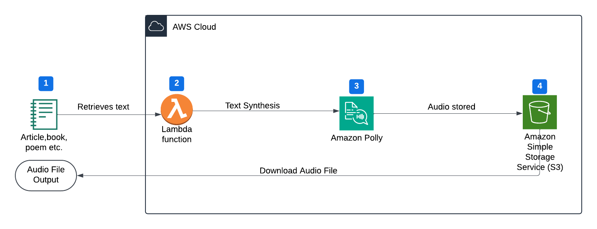
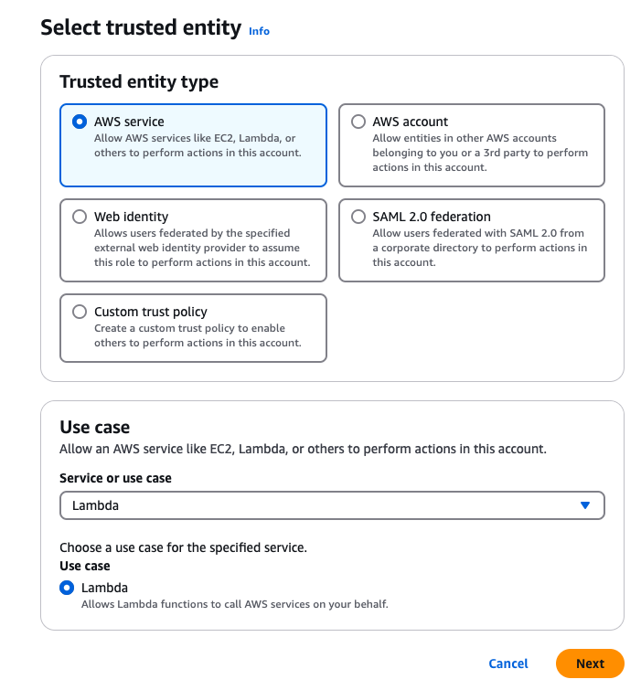
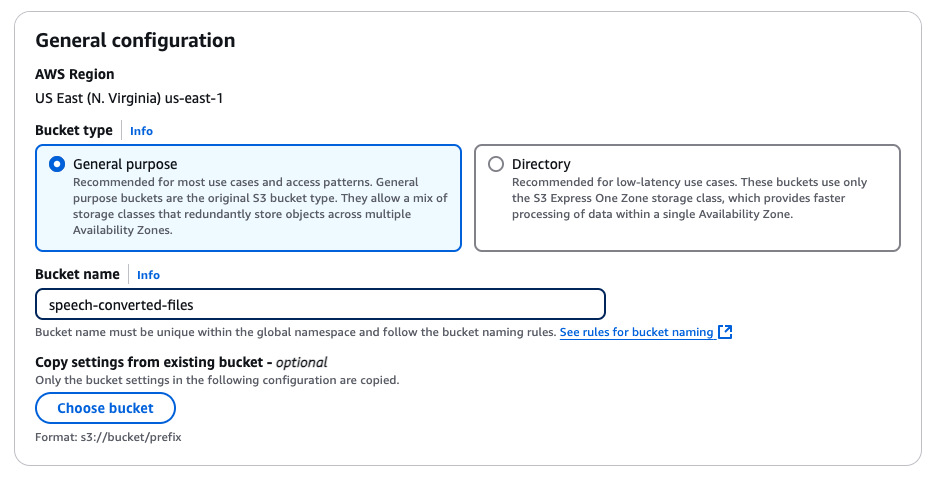
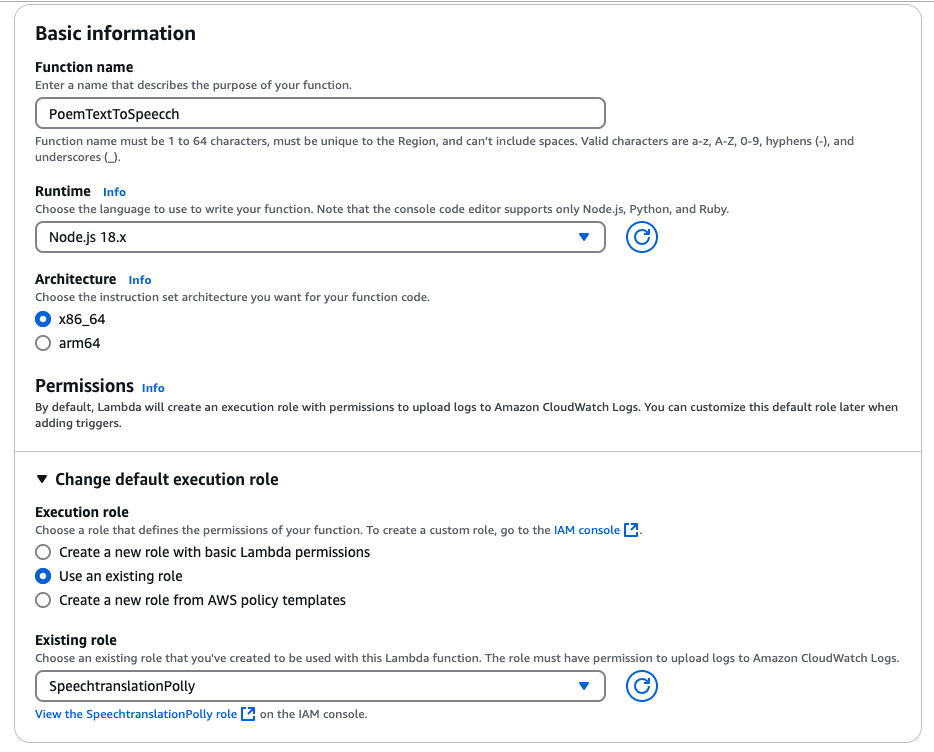
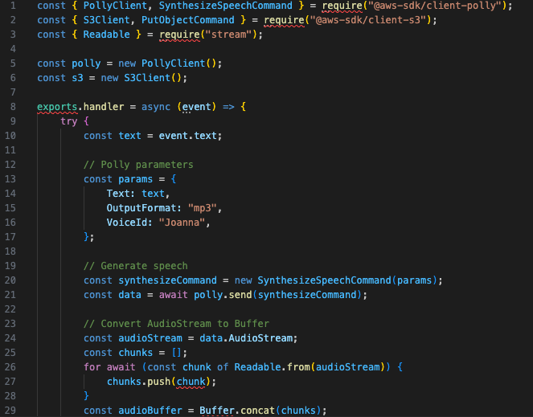
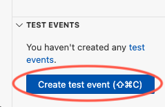
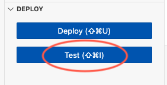
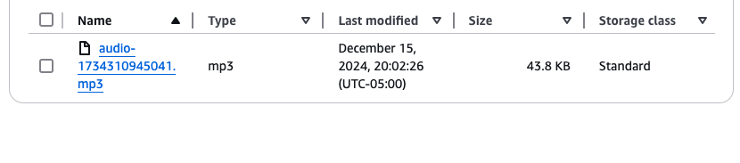

# Developing a Text Narrator Using Amazon Polly
## Project Overview
The objective of this project is to convert text into natural-sounding speech using Amazon Polly, a cloud-based text-to-speech service. While speech-to-text (STT) is widely recognized and integrated into modern devices, text-to-speech (TTS) plays an equally significant role—though it is often overlooked.TTS technology is widely used across digital content creation, from narrated videos and short-form media to audiobooks and automated voice assistants. It is also a critical tool for accessibility, providing visually impaired individuals with a way to consume written content. Additionally, businesses leverage TTS for customer service automation, interactive voice response (IVR) systems, and localized multilingual communication.By leveraging Amazon Polly, organizations can integrate cost-effective, scalable, and customizable speech synthesis into their applications, enhancing user engagement and accessibility.
## Sequence
- Creating an IAM role
- Creating an S3 Bucket
- Writing Lambda function code
- Checking the output of Amazon Polly

## Step 1: Assign IAM roles for lambda Execution
To enable Lambda to execute the necessary tasks, I first attached the required IAM roles via the IAM console: AmazonPollyFullAccess, AmazonS3FullAccess, AWSLambdaBasicExecutionRole

## Step 2: Create an S3 Bucket for Storing Converted Speech
To enable Lambda to execute the necessary tasks, I first attached the required IAM roles via the IAM console: AmazonPollyFullAccess, AmazonS3FullAccess, AWSLambdaBasicExecutionRole
- I created an S3 bucket where the converted speech files will be stored.
- I named the bucket "speech-converted-files" and kept the default configurations.
  
## Step 3: Create and Configure the Lambda Function 
- In the AWS Lambda console, I created a new Lambda function and assigned it the IAM roles from Step 1. ‍
Named the function appropriately.Chose Node.js as the runtime.Selected "Use an existing role".

- Edited the index.mjs file to implement text-to-speech conversion using Amazon Pollyand storage in S3: Renamed index.mjs to index.js. Inserted the appropriate code for Lambda execution.Deployed the updated code.

  

## Step 4: Test the Text-to-Speech Conversion 
- Created a test event in Lambda and input the text I wanted to convert.

  

- Executed the test event to verify the function's performance.

  

- Upon successful execution, the converted speech file was generated and stored in the S3 bucket.

  
